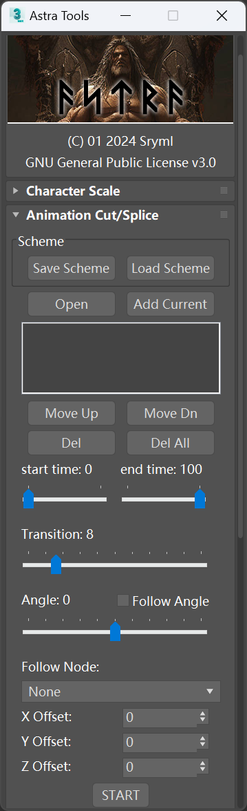

<h1 align="center">AstraTools</h1>

  

 

## ✨ 3D Utils for Blade of Darkness

3DS Max 2.5 or higher compatible

Current test version: **3ds Max 2019**  
_Note: Due to limitations in MaxScript for Max 2.5, some features will be unavailable, such as import/export._

## 📖 Usage

Copy the "Scripts" folder from "3ds Max" to the installation directory(`3DSMAX2.5 or 3ds Max xxxx`) of 3dsmax.

## 🌟 3D Tutorials for Blade

- [Severance: Blade 3D by R3D](https://www.moddb.com/games/severance-blade-of-darkness/tutorials/severance-blade-3d-by-r3d)

## 🛠 Update

### v1.1

- demonstration - https://youtu.be/ZAYt_PygKyw  
   
- Added function `Camera Transform`
- Added function `Export BMV`
- Added function `Export CAM`
- Added function `Import CAM`  
   
- `Animation Reverse` - Fixed animation range error  
   
- `Animation Splice` - Fixed animation range error
- `Animation Splice` - Added more buttons
- `Animation Splice` - Added Follow Angle
- `Animation Splice` - Added Follow Node
- `Animation Splice` - Added custom angle
- `Animation Splice` - Added custom offset
- `Animation Splice` - Added Save/Load Scheme (Not available in Max 2.5)
- `Animation Splice` - Now allows adjusting properties for each animation separately (transition, offset ...etc)
- `Animation Splice` - Now supports splicing animations with groups
- `Animation Splice` - Now allows adding duplicate animation files  
   
- `Export BOD` - Fixed error occurring when groups are missing  
   
- Optimize code namespaces

### v0.7.0

- Fixed edge export

### v0.6.4

- Fixed character skin again
- Fixed skin vertex search
- Fixed max8 error

### v0.6.2

- Improve the compatibility of Export BOD
- Fixed character skin
- Optimize export efficiency

### v0.5.9

- Added function `Export BOD`

### v0.3

- Added function `Animation Reverse`
- Added function `Animation Cut`

### v0.2

- Added function `Animation Splice`
- demonstration  
  https://youtu.be/utP812FJymQ

### v0.1

- Added function `Transform character Scale`

<!-- ## 🐞Known Issues -->

## 🌍 Future

- Import BOD
- Import BMV

## 📄 Reference

Harrison's export [script](https://disk.yandex.ru/d/8koexOk_iu4HG).  
TPBladeToolsChar_M25 by TPTPT (TP's tools inspired me to do this project)

<!-- The logo from [Blade of Darkness](https://store.steampowered.com/app/1710170). -->

## 💗 Thanks

The max file provided by Harrison makes this possible.  
All the people who provided feedback, tested, and supported this project.

## 🧩 Interface

<!--  -->
